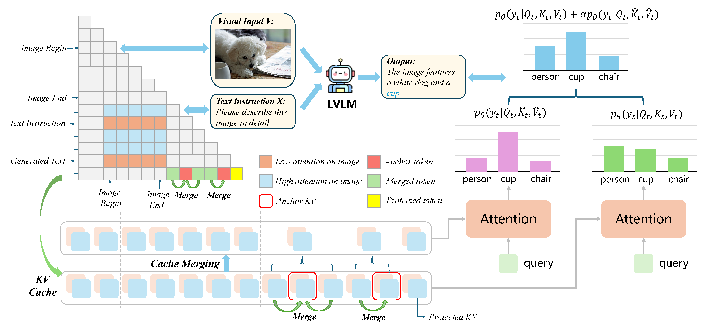
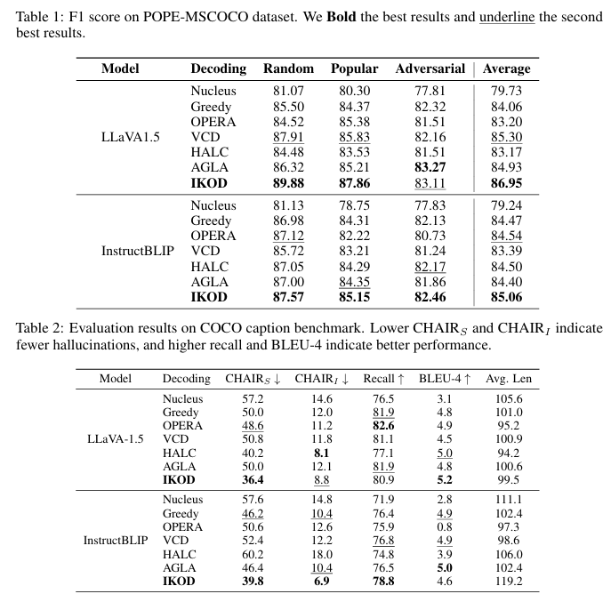
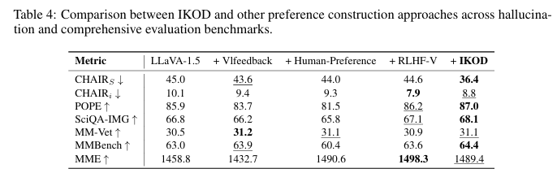
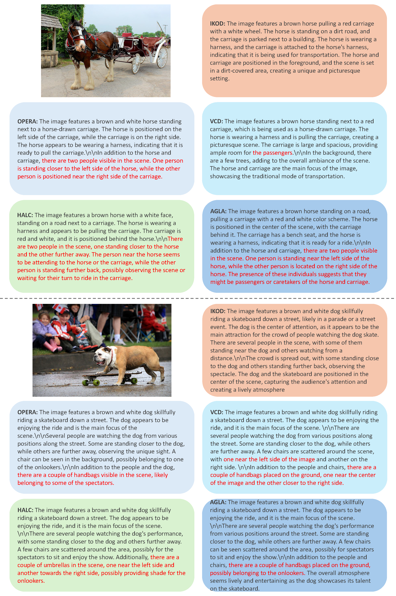

# IKOD: Fading Focus: Mitigating Visual Attention Degradation in Large Vision-Language Models
Chenhang Cui*, Jiabing Yang*, Yiyang Zhou, Peng Xia, Ying Wei, Huaxiu Yao 
<div align="center">
*Equal Contribution
</div>
This is the official repo for IKOD, a simple, training-free method for mitigating hallucinations in LVLMs during decoding without utilizing external tools.

<div style='display:flex; gap: 0.25rem; '>
<a href='LICENCE'></a>
<a href='https://arxiv.org/abs/2311.16922'></a>
<!-- <a href='https://twitter.com/Leon_L_S_C'></a> -->
</div>

<!-- ## 🔥 Update
* [2024-04-05]: ⭐️⭐️⭐️ VCD is selected as Poster Highlight in CVPR 2024! (Top 11.9% in accepted papers)
* [2023-11-29]: ⭐️ Paper of VCD online. Check out [this link](https://arxiv.org/abs/2311.16922) for details.
* [2023-11-28]: 🚀 Codes released. -->

## 🎯 Overview

- We investigate the relationship between Large Vision-Language Models (LVLMs) performance and their visual attention, revealing that as the sequence length increases, the model’s attention to the image diminishes. This diminishing attention leads to performance degradation and errors in the generated responses. 
- We introduce IKOD, an image attention-guided key-value merging collaborative decoding strategy. This method endows text sequence with high attention on image using key-value merging and integrates the augmented decoding process with the original decoding process to obtain a more accurate output distribution.
- IKOD does not require additional training or external tools, which is more easily applicable to various models.


## 🕹️ Usage
### Environment Setup
```bash
conda create -n IKOD python=3.9
conda activate IKOD
cd IKOD
pip install -r requirements.txt
```

### Running

To run experiments on POPE with LLaVA 1.5 or InstructBLIP, use the following commands in the eval folder:
```
cd experiments
bash cd_scripts/llava_pope.bash
bash cd_scripts/instructblip_pope.bash
```
To evaluate model performance on POPE, use eval_pope.py.

For other datasets, modify the file paths and prompts in corresponding files to generate results and evaluate model performance following the guidance of their original repositories.

## 🏅 Experiments
- **IKOD significantly mitigates the hallucination issue across different LVLM families.**


- **Beyond mitigating hallucinations, VCD also excels in comprehensive LVLM benchmarks, highlighting its wide-ranging applicability.**




- **Please refer to our paper for detailed experimental results.**


## 📌 Examples

*figure 1. Two examples of generated captions by different decoding methods with LLaVA-1.5 backbone.*


## 📑 Citation
If you find our project useful, we hope you can star our repo and cite our paper as follows:
<!-- ```
@article{damonlpsg2023vcd,
  author = {Sicong Leng, Hang Zhang, Guanzheng Chen, Xin Li, Shijian Lu, Chunyan Miao, Lidong Bing},
  title = {Mitigating Object Hallucinations in Large Vision-Language Models through Visual Contrastive Decoding},
  year = 2023,
  journal = {arXiv preprint arXiv:2311.16922},
  url = {https://arxiv.org/abs/2311.16922}
}
``` -->

<!-- ## 📝 Related Projects
- [LLaVA 1.5](https://github.com/haotian-liu/LLaVA): Improved Baselines with Visual Instruction Tuning
- [InstructBLIP](https://github.com/salesforce/LAVIS/tree/main/projects/instructblip): Towards General-purpose Vision-Language Models with Instruction Tuning
- [AGLA](https://github.com/Lackel/AGLA/): AGLA: Mitigating Object Hallucinations in Large Vision-Language Models with Assembly of Global and Local Attention -->
